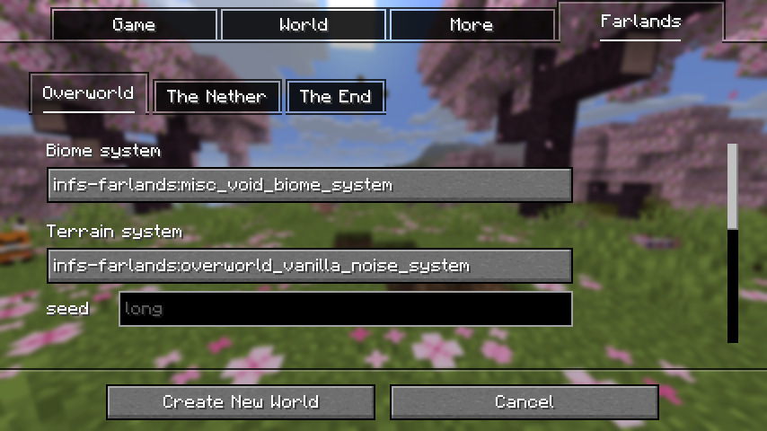

# Using Systems

On the **Create New World** screen, you can switch to this page by clicking the **Farlands** tab.

On this page, you can configure the **systems** and their parameters used by each dimension.

> The data is saved to `world/data/infs-farlands/systems.dat`.

As shown below:

